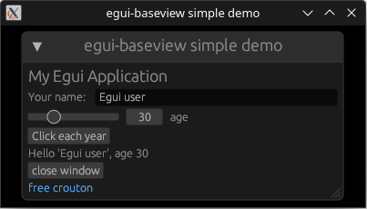

# egui-baseview

[](https://github.com/BillyDM/egui-baseview/blob/main/LICENSE)

A [`baseview`](https://github.com/RustAudio/baseview) backend for [`egui`](https://github.com/emilk/egui). This also contains an adapter for [`NIH-plug`](https://github.com/robbert-vdh/nih-plug).

<div align="center">
    
</div>


## How to use with custom plugin framework

Add the following to your `Cargo.toml`:

```toml
egui-baseview = { git = "https://codeberg.org/BillyDM/egui-baseview", branch = "main }
```

or if you want to use a specific version of egui:

```toml
egui-baseview = { git = "https://codeberg.org/BillyDM/egui-baseview", branch = "egui_32 }
```

*(Example plugin code is still a WIP)*

## How to use with NIH-plug

Add the following to your `Cargo.toml` (in place of `nih_plug_vizia`):

```toml
nih_plug_egui = { git = "https://codeberg.org/BillyDM/egui-baseview", branch = "main }
```

or if you want to use a specific version of egui:

```toml
nih_plug_egui = { git = "https://codeberg.org/BillyDM/egui-baseview", branch = "egui_32 }
```

See the `nih_plug_gain_egui` example for how to hook up `egui` to your plugin.

To build the `nih_plug_gain_egui` example, run:
```
cargo xtask bundle nih_plug_gain_egui --release
```

## Prerequisites

### Linux

Install dependencies, e.g.,

```sh
sudo apt-get install libx11-dev libxcursor-dev libxcb-dri2-0-dev libxcb-icccm4-dev libx11-xcb-dev mesa-common-dev libgl1-mesa-dev libglu1-mesa-dev
```
